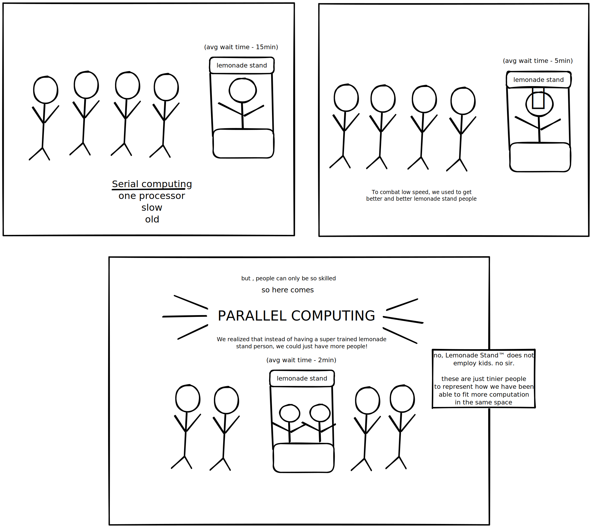
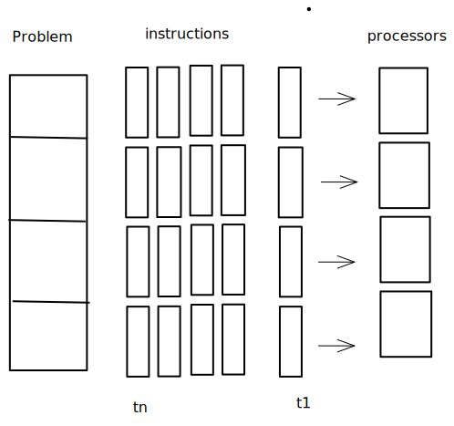
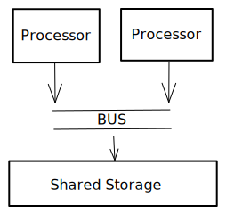

# Parallel Computing 
**many instructions** are carried out **simultaneously** 
depending on the theory that large problems can often be divided into smaller ones, and then solved concurrently ("in parallel")

it is the main model in computer architecture (multiple cores)

## Why did it arise? 

to understand Parallel Computing, we need to understand why it arose

### Serial Computing / Sequential Computing 
one task(operation/instruction) at a time, in sequence 

```mermaid
flowchart LR
d-->c-->b-->a-->x(processor)
a(task a)
b(task b)
c(task c)
d(task d)
```
###
- due to hitting a **bottleneck** in terms of **frequency scaling** [^1]
- higher frequency = more power draw, more heat generated 
- so instead, we have been able to reduce space needed for components and  pack more computational power in. **More  number of compute models instead of higher frequency** 
### Silly drawing I made to understand parallel computing better

## Features 
one computer; many processors/cores 
usually share storage
- main model in computers, as multi-core processors (multiple processing units on the same chip)
- saves time and money 
- improves performance 
- SINGLE COMPUTER
-  can use shared or distributed memory 
- COMMUNICATION between cores VIA BUS 
- Fault Tolerance (if one core fails, other is there; redundancy)

1) A problem is broken down in into smaller parts each of which is processed simultaneously by multiple cores / processors

2) Two cores sharing the same storage via a bus

## Elements of Parallel Computing 
1. **Computational Problem**    
	three types: 
	numerical, logical reasoning, transaction processing 
	complex problems might need all 
2. **Computer Architecture** 
	Von Neumann architecture to multi-core and  multi-computer
	lots of revolutionization
3. **Performance** 
	depends on machine capability and program behaviour 	
4. **Application Software** 
	type of computer program that performs specific functions
	end-user software
5. **OS**
	interface between a computer user and computer hardware
	file management, memory management
	handles basic functions
6. Hardware Architecture 
	   Single instruction single data (SISD)
	   Multiple instruction  Single Data (MISD)
	   Single instruction multiple data (SIMD)
	   Multiple instruction multiple data (MIMD)
7. Mapping
	   specifies where to execute each task

##

also see : [[Distributed Computing]]
[[Parallel vs Distributed Computing]]
[[Moore's Law]]

[^1]: Frequency scaling or ramping was the dominant force in  processor performance increases from the mid-1980s until roughly the end of 2004. Frequency Scaling = increasing the frequency of the processor / clock, thereby reducing runtime. 
